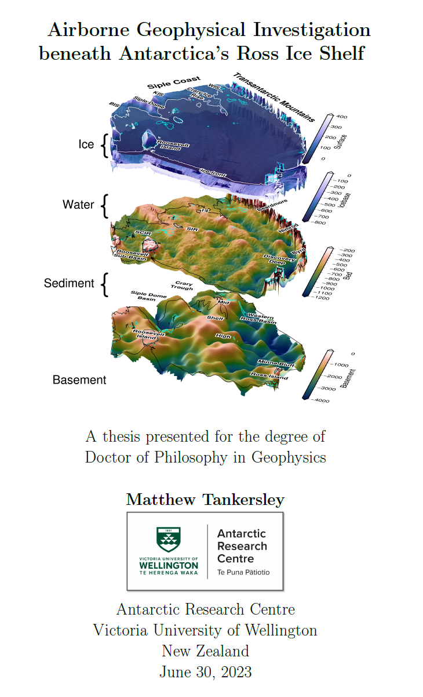

# Airborne Geophysical Investigation beneath Antarctica’s Ross Ice Shelf
- Author: [Matthew Tankersley](https://orcid.org/0000-0003-4266-8554)
- Supervisors: [Huw Horgan](https://orcid.org/0000-0002-4836-0078) & [Fabio Caratori Tontini](https://orcid.org/0000-0002-2000-416X)

This repository contains all of the latex files to general the [pdf of the thesis](drafts/phdthesis_final.pdf). It also contains a [Jupyter notebook](thesis_figures.ipynb) for creating the figures for the intro and synthesis chapters.

The final thesis PDF is available here: https://doi.org/10.26686/wgtn.24408304

## Abstract
The Ross Ice Shelf controls the flow of ice into the ocean from catchments consisting of both the East and West Antarctic Ice Sheets. These catchments hold a volume of ice equivalent to ∼12 m of global sea level rise. To adequately understand how this ice will respond to a warming world requires knowledge of the properties and parameters which influence how the ice sheet behaves. These boundary conditions include fundamental knowledge of the Earth, such as the shape of the bed beneath the ice, the seafloor, and the geologic structures of the upper crust. Knowledge of the physiography and sub-surface geology is severely lacking beneath ice shelves due to their inaccessibility.

Here, we use airborne geophysical data from an extensive survey over the Ross Ice Shelf to better understand these boundary conditions. From the analysis of airborne magnetics data, we model the thickness of sediment, the shape of the crystalline basement, and the likely locations of faults throughout the crust under the Ross Ice Shelf. We find a continuous drape of sediment over the seafloor, including deep and narrow fault-bound sedimentary basins beneath the Siple Coast.

Using airborne gravity data, and distributed seismic constraints over the ice shelf, we develop and implement a gravity inversion to recover a higher-resolution bathymetry model beneath the ice shelf. This bathymetry model and our quantification of spatial uncertainty highlight locations likely important for sub-ice shelf ocean circulation and possible recent pinning points. In the process of these geophysical investigations, we reveal a wide range of insights relating to how bathymetry and geology play a critical role in the past, present, and future dynamics of the ice sheet, and how this region has developed over its tectonic history.

## Plain language summary
The Ross Ice Shelf in Antarctica is a vast expanse of floating ice, hundreds of meters thick, which is connected to the ice on land. It plays a crucial role in slowing down the flow of ice from the Antarctic Ice Sheet into the ocean. Understanding how this ice will respond to a warming world requires knowledge of the Earth’s properties that influence its behaviour. These properties include the depth of the seafloor beneath the ice shelf, the topography beneath the ice on land, and geological features like faults and rock types. However, accessing and surveying the sub-Ross Ice Shelf is challenging, leading to limited knowledge.

In this thesis, we utilized data collected during an airborne survey of the entire Ross Ice Shelf to investigate the depths of the seafloor and the underlying geology. By analyzing measurements of Earth’s magnetic field across the ice shelf, we reveal the thickness of sediment beneath the seafloor. This is possible due to variations in magnetic properties between sediment and bedrock. The thickness of this layer of sediment ranges from tens of meters to several kilometers. Additionally, we determine the shape of the underlying bedrock, which helps identify probable fault locations.

We also utilized measurements of changes in Earth’s gravity field across the ice shelf to estimate the depth of the seafloor, in a process called a gravity inversion. This method is feasible since variations in the underwater topography (bathymetry) result in small, measurable changes in Earth’s gravity, due to the density difference between the seafloor and the water. This bathymetry model, along with our assessment of uncertainties, identifies areas beneath the ice shelf that likely influence ocean currents as well as potential locations where the ice shelf was anchored to the bedrock in the recent past. Through these geophysical investigations, we gained valuable insights into how features of the underlying Earth have influenced the behaviour of the overlying ice in the Ross Ice Shelf region, both historically and in the future. This information enhances our understanding of the Ross Ice Shelf region and its interaction with the underlying Earth.

    

## Code availability
All of the software developed in this thesis is open source. This includes the code to create most of the figures in this thesis. These figures were created with [Antarctic-Plots](https://antarctic-plots.readthedocs.io/en/latest/), a Python package I developed during this thesis to aid in Antarctic research.

### Chapter 2: Airborne magnetic analysis: Basement depths and sediment thickness

- Paper DOI: https://doi.org/10.1029/2021GL097371
- Code DOI: https://zenodo.org/record/6499863
- [GitHub Repository](https://github.com/mdtanker/RIS_basement_sediment)
- [Main notebook](https://nbviewer.org/github/mdtanker/RIS_basement_sediment/blob/main/Tankersley2022_GRL.ipynb)

### Chapter 3: Gravity inversion: a tool for bathymetry modelling

- Code DOI: https://doi.org/10.5281/zenodo.8084469
- [GitHub Repository](https://github.com/mdtanker/RIS_gravity_inversion)
- Main notebooks
  - [simple synthetic model](https://nbviewer.org/github/mdtanker/RIS_gravity_inversion/blob/main/notebooks/synthetic_inversion/synthetic_simple_inversion.ipynb)
  - [with a regional field](https://nbviewer.org/github/mdtanker/RIS_gravity_inversion/blob/main/notebooks/synthetic_inversion/synthetic_simple_inversion_with_regional.ipynb)
  - [Ross Sea semi-synthetic model](https://nbviewer.org/github/mdtanker/RIS_gravity_inversion/blob/main/notebooks/Ross_Sea_inversion/Ross_Sea_synthetic_inversion.ipynb)

### Chapter 4: Ross Ice Shelf bathymetry inversion

- Code DOI: https://doi.org/10.5281/zenodo.8084469
- [GitHub Repository](https://github.com/mdtanker/RIS_gravity_inversion)
- Main notebooks
  - [figures](https://nbviewer.org/github/mdtanker/RIS_gravity_inversion/blob/main/notebooks/Ross_Ice_Shelf_inversion/RIS_inversion_figures.ipynb)
  - [inversion](https://nbviewer.org/github/mdtanker/RIS_gravity_inversion/blob/main/notebooks/Ross_Ice_Shelf_inversion/RIS_inversion.ipynb)
  - [uncertainties](https://nbviewer.org/github/mdtanker/RIS_gravity_inversion/blob/main/notebooks/Ross_Ice_Shelf_inversion/RIS_montecarlo_uncertainties.ipynb)

## Citing

Please use the below citation formats (APA 7th edition) or BibTeX to cite this PhD thesis in your work!

Tankersley, M. (2023). Airborne Geophysical Investigation beneath Antarctica's Ross Ice Shelf (Version 1). Open Access Te Herenga Waka-Victoria University of Wellington. https://doi.org/10.26686/wgtn.24408304

@article{Tankersley2023,
author = "Matthew Tankersley",
title = "{Airborne Geophysical Investigation beneath Antarctica's Ross Ice Shelf}",
year = "2023",
month = "10",
url = "https://openaccess.wgtn.ac.nz/articles/thesis/Airborne_Geophysical_Investigation_beneath_Antarctica_s_Ross_Ice_Shelf/24408304",
doi = "10.26686/wgtn.24408304"
}
